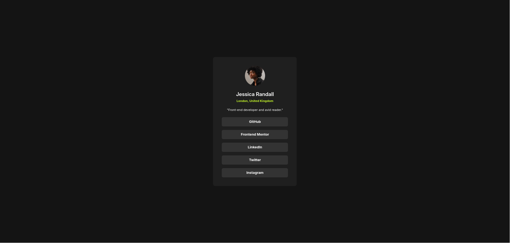

# Frontend Mentor - Social links profile solution

This is a solution to the [Social links profile challenge on Frontend
Mentor](https://www.frontendmentor.io/challenges/social-links-profile-UG32l9m6dQ).

## Table of contents

- [Overview](#overview)
  - [The challenge](#the-challenge)
  - [Screenshot](#screenshot)
  - [Links](#links)
- [My process](#my-process)
  - [Built with](#built-with)
  - [What I learned](#what-i-learned)
  - [Continued development](#continued-development)
  - [AI Collaboration](#ai-collaboration)

## Overview

### The challenge

### Screenshot



### Links

- [Solution URL](https://github.com/codetusk/frontend-mentor/tree/main/social-links-profile-main)
- [Live Site URL](https://codetusk.github.io/Frontend-mentor/social-links-profile-main/)

## My process

### Built with

- Semantic HTML5 markup
- CSS custom properties
- CSS Flexbox

### What I learned

On paper this is a small card, but it was a good excuse to slow down and brush up
on some theory.
At the end of my first iteration and after learning a lot more
about flexbox and its properties, I ended up redoing my past exercises.

Learned to use custom properties to make the css more maintainable,
and where to usually place them and it would be on the :root.
It made changing the accent colors a one-line edit:

```css
:root {
  --primary-color: hsl(75, 94%, 57%);
  --grey700: hsl(0, 0%, 20%);
  --grey800: hsl(0, 0%, 12%);
  --grey900: hsl(0, 0%, 8%);
}
```

**Flexbox** kept clicking a bit more. Almost every block here is a
`flex-direction: column` with `justify-content` and `align-items` centring its
children, and once I leaned on `gap` for spacing I stopped reaching for margins
to push things apart. Centring the whole card on the page turned out to be the
same idea applied to the `body`:

```css
body {
  min-height: 100vh;
  display: flex;
  flex-direction: column;
  justify-content: center;
  align-items: center;
}
```

I also learned a bit about media queries and how important they
are to make responsive websites.

```css
@media (min-width: 26rem) {
  article {
    padding: 2.5rem;
  }
}
```

### Continued development

- Keep drilling **Flexbox** until the two-axis model is instinct, and start
  bringing **CSS Grid** into the same kind of small project.
- Learn more about media queries and how to use them properly.

### AI Collaboration

I used Claude the same way I have on the earlier challenges: as a sounding board
and a devil's advocate, not a code generator.
